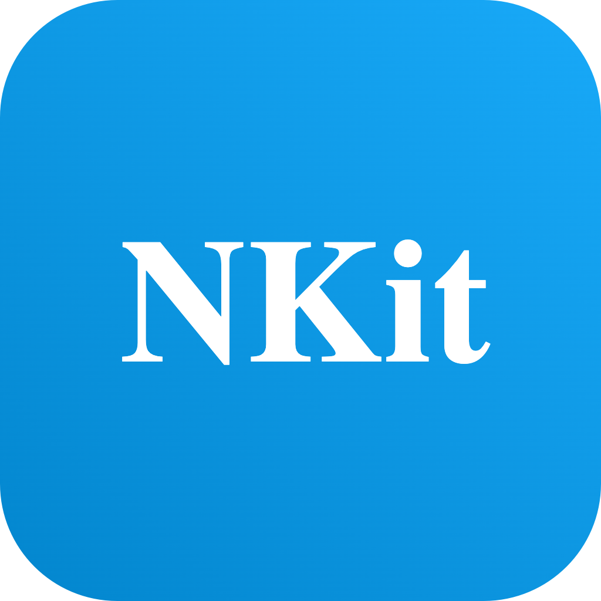

# NextcloudKit V 2


## Installation

### Carthage

[Carthage](https://github.com/Carthage/Carthage) is a decentralized dependency manager that builds your dependencies and provides you with binary frameworks.

To integrate **NextcloudKit** into your Xcode project using Carthage, specify it in your `Cartfile`:

```
github "nextcloud/NextcloudKit" "main"
```

Run `carthage update` to build the framework and drag the built `NextcloudKit.framework` into your Xcode project.

### Swift Package Manager

[Swift Package Manager](https://swift.org/package-manager/) is a tool for automating the distribution of Swift code and is integrated into the `swift` compiler. 

Once you have your Swift package set up, adding NextcloudKit as a dependency is as easy as adding it to the `dependencies` value of your `Package.swift`.

```swift
dependencies: [
    .package(url: "https://github.com/Nextcloud/NextcloudKit.git", .upToNextMajor(from: "2.0.0"))
]
```

### Manual

To add **NextcloudKit** to your app without Carthage, clone this repo and place it somewhere in your project folder. 
Then, add `NextcloudKit.xcodeproj` to your project, select your app target and add the NextcloudKit framework as an embedded binary under `General` and as a target dependency under `Build Phases`.

## Testing

### Unit tests:

Since most functions in NextcloudKit involve a server call, you can mock the Alamofire session request. For that we use [Mocker](https://github.com/WeTransfer/Mocker).

### Integration tests:
To run integration tests, we need a docker instance of a Nextcloud test server.
The CI does all this automatically, but to do it manually:
1. Run `docker run --rm -d -p 8080:80 ghcr.io/juliushaertl/nextcloud-dev-php80:latest` to spin up a docker container of the Nextcloud test server.
2. Log in on the test server and generate an app password for device. There are a couple test accounts, but `admin` as username and password works best.
3. Run `./generate-env-vars.sh`. This will generate an `.env-vars` file in the root directory. It contains env vars that the project will use for testing.
4. Provide proper values for the env vars inside the file. Here is an example:
```
export TEST_SERVER_URL=http://localhost:8080
export TEST_USER=nextcloud
export TEST_PASSWORD=FAeSR-6Jk7s-DzLny-CCQHL-f49BP
```
5. Run `./generate-env-vars.sh` again to regenerate the env vars. If all the values are set correctly you will see a generated file called `EnvVars.generated.swift`. It contains the env vars as Swift fields that can be easily used in code:
```
/**
This is generated from the .env-vars file in the root directory. If there is an environment variable here that is needed and not filled, please look into this file.
 */
 public struct EnvVars {
  static let testUser = "nextcloud"
  static let testPassword = "FAeSR-6Jk7s-DzLny-CCQHL-f49BP"
  static let testServerUrl = "http://localhost:8080"
}
```

Note that you always have to run `./generate-env-vars.sh` if you change the values inside `.env-vars`.

6. You can now run the integration tests. They will use the env vars to connect to the test server to do the testing. 
